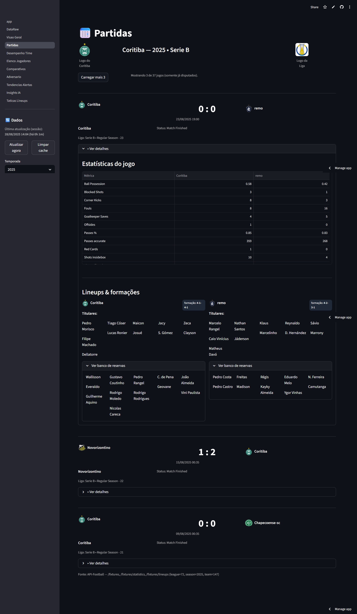
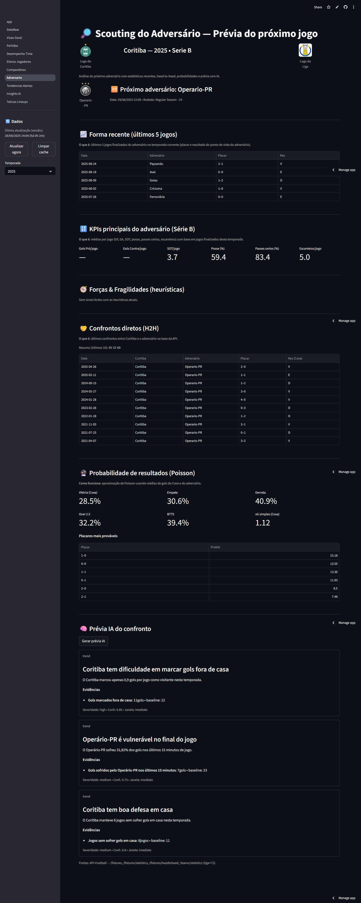

# ⚽ Coritiba Analytics AI Dashboard


## 📖 Sobre o projeto

O **Coritiba Analytics AI Dashboard** é um MVP desenvolvido em **Streamlit** que centraliza estatísticas, análises automáticas e insights de IA sobre o desempenho do **Coritiba Foot Ball Club** na Série B do Campeonato Brasileiro.

O projeto combina:
- 📊 Dados em tempo real da **API-Football**
- 🧠 Insights automáticos via **IA (OpenAI)**
- 🔄 Cache inteligente para reduzir chamadas de API
- 🎨 Visualizações interativas (KPIs, comparativos, tendências, previsões)

Esse MVP foi pensado como **projeto de portfólio**, mas também pode ser expandido para cases reais em análise esportiva.

---

## 🚀 Funcionalidades principais

- **Visão Geral**  
  - Resumo da temporada (vitórias, derrotas, gols pró/contra, clean sheets)  
  - Curiosidades históricas do Coritiba  
  - Insights sugeridos por IA  

- **Partidas**  
  - Lista de jogos (últimos 3, com opção de carregar mais)  
  - Detalhes: escalações, formações, estatísticas  

- **Desempenho do Time**  
  - KPIs médios por jogo (chutes, posse, passes, escanteios)  
  - Tendências com médias móveis  
  - Comparativo Casa x Fora  
  - Previsão probabilística (Poisson) para próximos jogos  

- **Elenco & Jogadores**  
  - Estatísticas individuais (minutos, gols, assistências, rating, duelos)  
  - Filtros por posição e ordenação por KPIs  
  - Cards detalhados com métricas por jogador  

- **Adversário**  
  - Scouting do próximo adversário  
  - Forma recente (últimos 5 jogos)  
  - KPIs médios e heurísticas de forças/fragilidades  
  - Head-to-Head (H2H) com histórico de confrontos  
  - Prévia automatizada com IA  

- **Insights IA**  
  - Análises automáticas em linguagem natural  
  - Resumo interpretativo para cada contexto (time, jogo, temporada)  

---

## 🛠️ Tecnologias usadas

- **Frontend/Framework**
  - [Streamlit](https://streamlit.io/) — dashboards interativos
  - [Plotly](https://plotly.com/python/) — gráficos dinâmicos  

- **APIs**
  - [API-Football](https://www.api-football.com/) — dados de partidas, times e jogadores  
  - [OpenAI](https://openai.com/) — geração de insights por linguagem natural  

- **Backend & Infra**
  - Python 3.10+  
  - Streamlit Cloud (deploy)  
  - Cache de dados com `st.cache_data` e `st.cache_resource`  

- **Outros**
  - Pandas / NumPy (tratamento de dados)  
  - Requests (chamadas HTTP)  

---

## 📷 Prints do Dashboard

### Página inicial


### Partidas


### Desempenho do Time


### Elenco & Jogadores


### Adversário


> As imagens estão salvas na pasta `docs/screenshots/` para facilitar a visualização.

---

## ⚡ Como rodar localmente

1. Clone este repositório:
   ```bash
   git clone https://github.com/jeancmelo/coritiba-analytics-ai-dashboard.git
   cd coritiba-analytics-ai-dashboard
